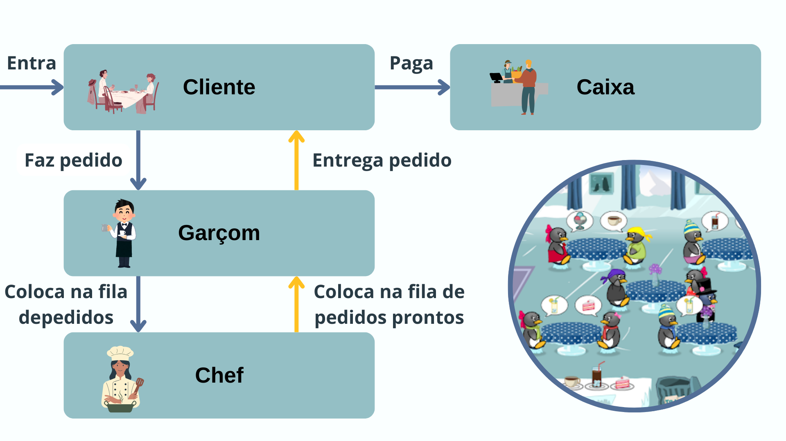

# Projeto-C012
Projeto desenvolvido para a disciplina de Sistemas Operacionais, utilizando o conceito de threads para criar uma simulação de restaurante. 

### Diagrama de funcionamento do projeto 

### Como rodar o código
Usar o comando 'python -m restaurante.main'

### Integrantes
Lara Conte Gomes, Lívia Cecília Gomes Silva, Lucca Ribeiro da Silva Lopes, Matheus Renó Torres, Tiago Augusto Costa Carvalho
